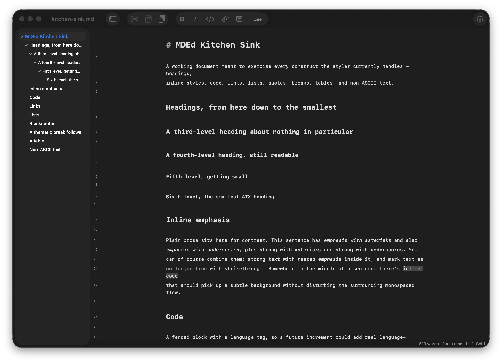

# MDEd

MDEd is a personal macOS Markdown editor, built from scratch in AppKit and TextKit 2 for the
macOS 26 SDK using Z.AI/GLM 5.3. It's a text editor first — every document is a plain `.md`/`.markdown`/`.txt` file on
disk, no proprietary format, no account, no sync service, everything is local.



## What makes it different

- **Two-file comparison with both panes editable.** File ▸ Compare Two Files… opens a side-by-side
  diff view with hunk navigation and take-left/take-right — but unlike most diff tools, neither
  side is read-only. Edit either document directly in the comparison window; the diff recomputes
  live as you type.
- **Live-preview editing.** Markdown markers (`##`, `**`, `` ` ``, `>`, list bullets) hide
  themselves except on the line you're actively editing; tables, math (`$inline$`/`$$display$$`),
  and Mermaid diagrams render inline in place of their raw source. Toggle it off (View ▸ Hide
  Markdown Syntax, ⌘/) and it's a plain styled-source editor instead — markers dimmed, not hidden.
- **On-device AI, nothing leaving the machine.** Summarize, tighten a selection, translate, or
  summarize a two-file diff, all through Apple's on-device Foundation Models — no API key, no
  network request, no cloud provider. See [On-device AI](#on-device-ai) below for exactly what that
  means and where it currently struggles.
- **Anchored review notes that survive edits.** Select a passage, attach a note (⌥⌘N), and keep
  writing — the note follows its passage. Notes live in a sidecar file next to the document
  (`notes.md.mded-notes.json`), never in the document itself, and when the text around a note
  changes, its status is honestly re-evaluated: **Anchored** (passage plus context still match),
  **Moved** (passage intact, surroundings changed), **Ambiguous** (the passage now occurs twice),
  or **Unmatched** (the passage is gone). See [Review notes](#review-notes) below.

Also included: a collapsible document outline sidebar (headings, nested by level, click to jump —
see [Document outline](#document-outline) below), a source-line-number gutter (in both the editor
and comparison panes), live Settings (⌘,) that apply to every open window immediately, and a small
set of deterministic Markdown commands (Insert Table of Contents, Normalize Formatting) that don't
touch the model at all.

## Building and running

```sh
xcodegen generate
xcodebuild -scheme MDEd -derivedDataPath /tmp/mded-dd build
open /tmp/mded-dd/Build/Products/Debug/MDEd.app
```

Requires Xcode with the macOS 26 SDK. [XcodeGen](https://github.com/yonaskolb/XcodeGen) generates
`MDEd.xcodeproj` from `project.yml` — the `.xcodeproj` itself isn't committed, so `xcodegen
generate` is the first step after every clone and after any `project.yml` change.

`./Scripts/smoke-launch.sh` launches a built app against each file in `Samples/` and confirms it
survives opening the document without crashing — see the script's own header comment for why this
exists as a check independent of the test suite below.

## Document outline

A collapsible outline sidebar on the document window's leading edge, listing the open document's
headings nested by level (built with `NSSplitViewController` for the standard `.sidebar` material
and collapse behavior, and `NSOutlineView` for the tree). Click an entry to scroll to it and place
the caret there; the entry containing the caret highlights itself as you move through the document,
and the tree refreshes as you type — both on the same debounce as the restyle pass, so neither
reparses on every keystroke. A document with no headings shows a quiet "No headings in this
document" message instead of a blank pane.

Toggle it from the toolbar's sidebar button, View ▸ Show Outline (⌥⌘S), or by dragging the divider;
all three keep every open document window's sidebar in sync and remember the choice for next
launch (`EditorSettings.showOutlineSidebar`). The heading/nesting/caret-mapping logic underneath
lives in `MDEdCore.OutlineTree` (see `Core/README.md`) — the sidebar itself is thin AppKit plumbing
on top of it.

**Document window only.** The comparison window doesn't get an outline: it already shows two panes
plus its own hunk navigation, and a third and fourth pane (one outline per side) would be too
cramped to be worth it.

## Review notes

Notes are review annotations pinned to a passage of text, in the spirit of
[revdown](https://github.com/Roenbaeck/revdown): the document stays byte-for-byte untouched, and
the annotation data lives in a versioned sidecar (`your-file.md.mded-notes.json`) that version
control can track alongside it.

Select text, press ⌥⌘N (or Notes ▸ Add Note to Selection, or the toolbar button), write the note.
It shows up as a colored bar in the margin beside its passage and a dot in the gutter; click the
dot to read, edit, reveal, or delete it. Notes ▸ Show All Notes lists every note on the document —
including unmatched ones, which have no on-screen location left to point at.

Each note's anchor records the selected text plus a window of surrounding context. As you edit,
anchors are re-resolved (on the same debounce as styling, not per keystroke) and each note drifts
through four states, shown everywhere the note appears:

| Status | Meaning | Bar/dot color |
| --- | --- | --- |
| Anchored | The passage *and* its recorded surroundings still match uniquely — even if everything shifted down ten pages. | yellow |
| Moved | The passage itself still occurs exactly once, but the text next to it changed. | orange |
| Ambiguous | The passage now occurs more than once; picking one would be a guess. | purple |
| Unmatched | The passage no longer exists. | red |

The conservative ordering is the point: a note never silently re-attaches itself somewhere it
merely plausibly fits — it says what happened and lets you decide. The anchoring model is pure
and headless-tested in `MDEdCore` (`ReviewNote`, `NoteAnchorResolver`); the sidecar and popovers
are AppKit/SwiftUI plumbing in `App/Notes/`.

Notes on an unsaved document live in memory until its first save, then reach the sidecar
automatically. A sidecar written by a newer MDEd (unknown format version) is never loaded and,
more importantly, never overwritten. Deleting the last note removes the sidecar entirely.

### The core logic package

The pure Markdown/diff/live-preview logic underneath the app — no AppKit, no file I/O, fully
headless-testable — lives in `Core/` as its own Swift package, `MDEdCore`. See
**[`Core/README.md`](Core/README.md)** for its module-by-module documentation and its own build/test
instructions (`cd Core && swift build && swift test`; 303+ tests, all headless, no app build
required to run them).

## Keyboard shortcuts

| Shortcut | Action |
| --- | --- |
| ⌘N | New document |
| ⌘O | Open… |
| ⌘W | Close |
| ⌘S | Save |
| ⇧⌘S | Save As… |
| ⇧⌘C | Compare Two Files… |
| ⌘Z / ⇧⌘Z | Undo / Redo |
| ⌘X / ⌘C / ⌘V | Cut / Copy / Paste |
| ⌘A | Select All |
| ⌘F | Find… |
| ⌘G / ⇧⌘G | Find Next / Find Previous |
| ⌘E | Use Selection for Find |
| ⌘L | Go to Line… (focuses the toolbar's line field) |
| ⌘/ | Toggle live preview (View ▸ Hide Markdown Syntax) |
| ⌥⌘S | Toggle the document outline sidebar (View ▸ Show Outline) |
| ⌥⌘N | Add a review note to the selection |
| ⌘, | Settings |
| ⌘? | MDEd Help |
| ⌘M | Minimize |
| ⌘H / ⌥⌘H | Hide MDEd / Hide Others |
| ⌘Q | Quit |

A handful of commands are reachable only from the menu bar or toolbar, with no key equivalent
assigned: Revert to Saved, Compare Frontmost With…, Show All Notes, Acknowledgements, everything
in the Format and AI menus (Insert Table of Contents, Normalize Formatting,
Summarize/Tighten/Translate), and the toolbar's Bold/Italic/Code/Link formatting buttons. All
four toolbar formatting buttons and every menu item
are still reachable with Full Keyboard Access on (System Settings ▸ Keyboard ▸ Keyboard
navigation) — Tab cycles through the toolbar and every other control, and every control shows a
visible focus ring; nothing in this app suppresses either.

Checked for conflicts across the whole menu bar while building this: none found. A few items
(Revert to Saved, Zoom, Bring All to Front, everything under Format and AI) simply have no
shortcut at all, matching how Apple's own apps typically leave infrequent commands unbound rather
than assigning one for its own sake.

## On-device AI

Every AI command (Summarize Document, Tighten Selection, Translate Selection/Document, and the
comparison window's Summarize Changes) runs through Apple's on-device Foundation Models —
`SystemLanguageModel`, available once Apple Intelligence is turned on for a supported Mac. There is
no API key to configure and no other backend to switch to; see `AIService`'s doc comment in the
source for why the app is still built against a protocol despite having exactly one implementation.

What that means concretely:
- **Nothing leaves the machine.** No network request, ever — confirmed at the framework level, not
  just by omission of networking code.
- **4,096-token context window**, measured directly against the real model (not a published spec —
  see `TokenEstimator`'s doc comment for the calibration data point). `DocumentChunker` splits
  anything larger at heading/paragraph/sentence boundaries, never mid-sentence, so each piece fits;
  Summarize and Translate chunk through `LanguageAwareChunker` instead, which adds a language
  boundary to that same list (see below) rather than replacing it.
- **23 languages** are supported by the underlying model; the Translate submenus offer a curated
  shortlist of eight for one-click access (English, Spanish, French, German, Portuguese, Japanese,
  Simplified Chinese, Korean) rather than the full list, since a giant menu or a free-text prompt
  both lose to "pick from a short list" for the common case.

**Known, measured weaknesses — mitigated below, none fully eliminated:**
- **Summarizing summaries degrades on very large documents — fixed for the common case.** A
  document with headings (essentially every real one — a solitary `#` document title above several
  `##` sections included) now takes `SummaryPlanner`'s per-section path instead: each top-level
  section is summarized once, independently, and presented as an outline, so no pass ever
  summarizes text that's already a summary. Verified against a real 154-line document: the old
  splitting rule collapsed it into a single section (the shallowest heading present was its one
  `#` title, so the whole document was "one section"); the fixed rule produces eleven, one per
  `##` section, each summarized independently by the real on-device model. A **headingless**
  document still over budget falls back to the original map-reduce, but its reduce step now uses
  `@Generable` guided generation (a typed summary-plus-key-points structure, not free prose) to
  push back against the same generic, repetitive drift a plain prompt didn't reliably prevent.
  Past a shallow recursion depth on a genuinely huge headingless document, that fallback still
  gives up compressing further and returns the numbered list as-is — readable, never an error, but
  visibly less polished. A chunk or section the model refuses outright is now skipped and noted
  rather than failing the whole command.
- **A chunk that straddles two languages can fail — fixed.** Summarize and Translate now chunk
  through `LanguageAwareChunker`, which partitions at detected language boundaries — using only
  prose blocks, never a heading, code block, or table, any of which the on-device recognizer can
  misread with high confidence (a heading alone has scored as French) — before budget-packing, so
  a chunk never mixes two languages the way a purely budget-driven pack sometimes did. Verified
  against a real concatenation of an English and a Portuguese document (six alternating language
  segments, zero mixed chunks): it now produces a real per-section summary instead of
  `GenerationError.unsupportedLanguageOrLocale`. A single paragraph that itself mixes two
  languages still reports only its dominant one — one paragraph is too small to trigger the
  chunk-scale failure this fixes, and splitting within one risks the same false-positive at finer
  grain; documented, not chased.
- **Tighten Selection and Translate sometimes add Markdown emphasis that wasn't in the source —
  caught mechanically, not prevented.** This is a real, observed model behavior, not a bug in the
  instruction text, and no instruction wording found eliminates it outright — reproduced directly
  against the real model during this fix (asked to tighten a bare `# Troubleshooting` heading, it
  invented a `## Issues` heading and a bulleted list of failure modes that were never in the
  source). Both commands now verify their result against the source with `MarkupComparator` — a
  plain count-per-kind comparison, not a trusted-away promise — and retry once with a corrective
  instruction naming exactly which markup kind was added. If the model reoffends even on retry (it
  did, in that same reproduction), the result still reaches the review sheet — never silently
  discarded or blocked — with the delta surfaced prominently above it, so the user sees exactly
  what changed before deciding to apply. It's also the reason every AI command in this app works
  the same way regardless: the result always opens in a review sheet with Copy/Discard/Apply, and
  nothing is ever written into a document without that explicit click — see `AIReview`'s doc
  comment for why that guarantee is structural (one shared review surface, one place `onApply` can
  be reached from) rather than a convention each command has to remember to follow.

## Live preview: caret behavior through hidden markers

The one risk in live-preview editing flagged repeatedly but never verified before this stage: with
markers hidden, does the layout manager's "next caret position" (computed against the *shortened
display* text) remap back to the right *source* offset, or drift by a character around a hidden
run? **Tested directly against the running app** — caret movement (arrow keys in both directions)
and shift-arrow selection across hidden `**bold**`/`` `code` ``/`[link](url)`/heading marker runs
both land correctly, with no drift observed. This risk is closed.

## Known limitations

- **A brand-new, never-saved document's window isn't restored at relaunch.** Per-document window
  frame and Resume-style reopening (see below) both key off the document's file URL; a document
  that was never saved to disk has none, so quitting with an unsaved "Untitled" window open loses
  that window (not its unsaved text — `NSDocument`'s own autosave-in-place still protects that the
  same way it always has, just not as a window that reopens itself).
- **The three AI weaknesses above** are now mitigated (per-section summarizing, language-aware
  chunking, mechanical markup-delta detection with retry) but none is fully eliminated — a
  headingless document over budget still degrades past a shallow recursion depth, a single
  paragraph mixing two languages still isn't split, and a model that reoffends on the corrective
  retry still gets its result shown, just flagged. See that section for what each mitigation
  actually covers.
- No notarization, sandboxing, App Store assets, update mechanism, cloud AI fallback, or
  import/export beyond plain `.md`/`.markdown`/`.txt` files. This is a personal tool, not a
  distributed product, and those are deliberately out of scope for now.

## Credit

This is a from-scratch rewrite, not a fork — but `Core/Sources/MDEdCore/WordCount/WordCount.swift`
is a Swift port of `backend/word_count.py` from the
[`markdown-reader`](https://github.com/petertzy/markdown-reader) project (MIT-licensed, Copyright
petertzy), including its CJK-aware word counting and its banker's-rounding reading-time estimate.
See [`LICENSE`](LICENSE) and that file's own doc comment.

## License

MIT, Copyright © 2026 Roland Chia — see [`LICENSE`](LICENSE) (which also carries the
third-party notices for the ported word-count logic and the swift-markdown dependency).
`Core/` has its own copy under the same terms.
